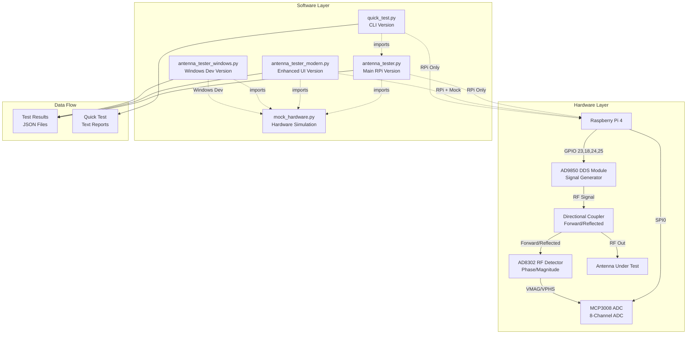

# RAPSI Antenna Tester - Component Connection Diagram

## System Architecture Overview



## Detailed Component Connections

### 1. Hardware Signal Chain

```
┌─────────────┐    ┌──────────────┐    ┌─────────────┐    ┌─────────────┐
│ Raspberry   │    │   AD9850     │    │ Directional │    │  Antenna    │
│    Pi       │───▶│ DDS Module   │───▶│   Coupler   │───▶│ Under Test  │
│             │    │              │    │             │    │             │
└─────────────┘    └──────────────┘    └─────┬───────┘    └─────────────┘
       │                                      │
       │           ┌──────────────┐          │
       │           │   AD8302     │◀─────────┘
       └──────────▶│ RF Detector  │
                   │              │
                   └──────┬───────┘
                          │
                   ┌──────▼───────┐
                   │   MCP3008    │
                   │    ADC       │
                   └──────────────┘
```

### 2. Software Architecture

```
┌─────────────────────────────────────────────────────────────┐
│                    USER INTERFACE LAYER                     │
├─────────────────┬─────────────────┬─────────────────────────┤
│ GUI (Tkinter)   │ Modern GUI      │ Command Line Interface  │
│ - Basic UI      │ - Enhanced UI   │ - Quick Test            │
│ - Real-time     │ - Dark/Light    │ - Automated Reports     │
│   plotting      │   themes        │ - Batch Processing      │
└─────────────────┴─────────────────┴─────────────────────────┘
                          │
┌─────────────────────────▼─────────────────────────────────────┐
│                  CORE ANALYZER CLASSES                       │
├─────────────────┬─────────────────┬─────────────────────────┤
│ AntennaAnalyzer │ModernAntenna    │ Hardware Abstraction    │
│ - Freq sweep    │Analyzer         │ - GPIO control          │
│ - SWR calc      │ - Enhanced      │ - SPI communication     │
│ - Rating system │   features      │ - Mock mode support     │
└─────────────────┴─────────────────┴─────────────────────────┘
                          │
┌─────────────────────────▼─────────────────────────────────────┐
│                   HARDWARE LAYER                             │
├─────────────────┬─────────────────┬─────────────────────────┤
│ Real Hardware   │ Mock Hardware   │ Platform Detection      │
│ - RPi.GPIO      │ - Simulation    │ - Auto-fallback         │
│ - spidev        │ - Windows dev   │ - Error handling        │
│ - Direct I/O    │ - Testing       │ - Status reporting      │
└─────────────────┴─────────────────┴─────────────────────────┘
```

### 3. Data Flow Diagram

```
START
  │
  ▼
┌─────────────┐
│ Initialize  │──── Hardware Check ────┐
│ Hardware    │                        │
└─────┬───────┘                        ▼
      │                         ┌─────────────┐
      ▼                         │    Mock     │
┌─────────────┐                 │  Hardware   │
│ Set Freq    │◀────────────────│ (Windows)   │
│ Range       │                 └─────────────┘
└─────┬───────┘
      │
      ▼
┌─────────────┐    ┌─────────────┐    ┌─────────────┐
│ Frequency   │───▶│  Measure    │───▶│ Calculate   │
│ Sweep Loop  │    │ Mag/Phase   │    │    SWR      │
└─────┬───────┘    └─────────────┘    └─────┬───────┘
      │                                      │
      ▼                                      ▼
┌─────────────┐                       ┌─────────────┐
│ Progress    │                       │ Store Data  │
│ Update      │                       │   Point     │
└─────────────┘                       └─────┬───────┘
      │                                      │
      └──────────────────────────────────────┘
                          │
                          ▼
                   ┌─────────────┐
                   │ Rate Antenna│
                   │ Performance │
                   └─────┬───────┘
                         │
                         ▼
              ┌─────────────┐    ┌─────────────┐
              │ Display     │───▶│ Save        │
              │ Results     │    │ Results     │
              └─────────────┘    └─────────────┘
```

### 4. Class Relationships

```
┌─────────────────────────────────────────────────────────────┐
│                    antenna_tester.py                       │
├─────────────────────────────────────────────────────────────┤
│ class AntennaAnalyzer:                                      │
│   ├── __init__()           # Hardware setup                │
│   ├── setup_hardware()     # GPIO/SPI init                 │
│   ├── set_frequency()      # Control AD9850                │
│   ├── read_adc()          # Read MCP3008                   │
│   ├── measure_point()     # Single freq measurement        │
│   ├── frequency_sweep()   # Multi-point sweep              │
│   ├── rate_antenna_performance() # Scoring algorithm       │
│   └── cleanup()           # Resource cleanup               │
│                                                             │
│ class AntennaAnalyzerGUI:                                   │
│   ├── __init__()          # UI setup                       │
│   ├── setup_gui()         # Widget creation                │
│   ├── one_click_sweep()   # Main test function             │
│   ├── plot_results()      # Matplotlib integration         │
│   ├── save_results()      # JSON export                    │
│   └── on_closing()        # Cleanup on exit               │
└─────────────────────────────────────────────────────────────┘

┌─────────────────────────────────────────────────────────────┐
│                  antenna_tester_modern.py                  │
├─────────────────────────────────────────────────────────────┤
│ class ModernTheme:                                          │
│   ├── DARK = {...}        # Dark theme colors              │
│   └── LIGHT = {...}       # Light theme colors             │
│                                                             │
│ class ModernAntennaAnalyzer(AntennaAnalyzer):               │
│   ├── simulate_antenna_response() # Mock antenna data      │
│   └── [inherits all other methods]                         │
│                                                             │
│ class ModernAntennaGUI:                                     │
│   ├── setup_modern_styling() # Theme application           │
│   ├── create_modern_card()   # UI components               │
│   ├── toggle_theme()         # Dark/light switching        │
│   ├── show_history()         # Results browser             │
│   └── [enhanced versions of base methods]                  │
└─────────────────────────────────────────────────────────────┘

┌─────────────────────────────────────────────────────────────┐
│                      mock_hardware.py                      │
├─────────────────────────────────────────────────────────────┤
│ class MockGPIO:                                             │
│   ├── setmode()           # GPIO mode simulation           │
│   ├── setup()             # Pin setup simulation           │
│   ├── output()            # Pin control simulation         │
│   └── cleanup()           # Cleanup simulation             │
│                                                             │
│ class MockSpiDev:                                           │
│   ├── open()              # SPI init simulation            │
│   ├── xfer2()             # ADC data simulation            │
│   └── close()             # SPI close simulation           │
└─────────────────────────────────────────────────────────────┘

┌─────────────────────────────────────────────────────────────┐
│                      quick_test.py                         │
├─────────────────────────────────────────────────────────────┤
│ def quick_sweep_and_rate():                                 │
│   ├── Initialize AntennaAnalyzer                           │
│   ├── Perform frequency_sweep()                            │
│   ├── Rate antenna performance                             │
│   ├── Display formatted results                            │
│   ├── Generate recommendations                             │
│   └── Save text report                                     │
└─────────────────────────────────────────────────────────────┘
```

### 5. GPIO Pin Mapping

```
Raspberry Pi GPIO Pins:
┌─────────────────────────────────────┐
│ 3.3V  │ 5V   │ GPIO2 │ 5V   │ GPIO3 │
│ GND   │ GPIO │ GPIO3 │ GND   │ GPIO4 │
│ GPIO17│ GPIO │ GPIO27│ GPIO22│ 3.3V  │
│ GPIO10│ GPIO9│ GPIO11│ GND   │ GPIO23│◀── AD9850 DATA
│ 3.3V  │ GND  │ GPIO5 │ GPIO6 │ GPIO13│
│ GPIO19│ GPIO26│ GND  │ GPIO18│◀──── AD9850 W_CLK
│ GPIO16│ GND  │ GPIO20│ GPIO21│ GPIO25│◀── AD9850 RESET
│ GND   │ GPIO │ GPIO24│◀─────────── AD9850 FQ_UD
│ SPI0  │ SPI0 │ SPI0  │ GND   │ SPI0  │
│ MOSI  │ MISO │ SCLK  │      │ CE0   │◀── MCP3008
└─────────────────────────────────────┘

SPI Connection to MCP3008:
├── MOSI (Pin 19) → DIN
├── MISO (Pin 21) → DOUT  
├── SCLK (Pin 23) → CLK
└── CE0  (Pin 24) → CS
```

### 6. File Dependencies

```
Project Files:
┌─────────────────────────────────────────────────────────────┐
│ antenna_tester.py                                           │
│ ├── imports: RPi.GPIO, spidev, numpy, matplotlib, tkinter  │
│ ├── creates: antenna_test_YYYYMMDD_HHMMSS.json             │
│ └── platform: Raspberry Pi only                            │
├─────────────────────────────────────────────────────────────┤
│ antenna_tester_modern.py                                    │
│ ├── imports: mock_hardware (fallback), enhanced libs       │
│ ├── creates: antenna_test_YYYYMMDD_HHMMSS.json             │
│ └── platform: Raspberry Pi + Windows (mock mode)          │
├─────────────────────────────────────────────────────────────┤
│ antenna_tester_windows.py                                   │
│ ├── imports: mock_hardware (required), same libs as main   │
│ ├── creates: antenna_test_YYYYMMDD_HHMMSS.json             │
│ └── platform: Windows development only                     │
├─────────────────────────────────────────────────────────────┤
│ quick_test.py                                               │
│ ├── imports: antenna_tester.AntennaAnalyzer                │
│ ├── creates: quick_test_YYYYMMDD_HHMMSS.txt                │
│ └── platform: Raspberry Pi only                            │
├─────────────────────────────────────────────────────────────┤
│ mock_hardware.py                                            │
│ ├── provides: MockGPIO, MockSpiDev classes                 │
│ ├── simulates: Real hardware for development               │
│ └── platform: Windows development support                  │
└─────────────────────────────────────────────────────────────┘

Dependencies:
┌─────────────────────────────────────────────────────────────┐
│ requirements.txt      # Main requirements                   │
│ requirements-rpi.txt  # Raspberry Pi specific              │
│ requirements-modern.txt # Enhanced version requirements     │
└─────────────────────────────────────────────────────────────┘
```

## Summary

This antenna tester system consists of:

1. **Hardware Layer**: Raspberry Pi controlling AD9850 DDS, reading AD8302 through MCP3008 ADC
2. **Core Engine**: AntennaAnalyzer class handling all measurements and calculations  
3. **Multiple Interfaces**: GUI (basic/modern), CLI, and Windows development versions
4. **Mock System**: Complete hardware simulation for Windows development
5. **Data Pipeline**: Real-time measurement → SWR calculation → Performance rating → Results export

The modular design allows for:
- Cross-platform development (RPi hardware + Windows simulation)
- Multiple user interfaces (GUI vs CLI)
- Easy testing and debugging
- Extensible measurement capabilities 